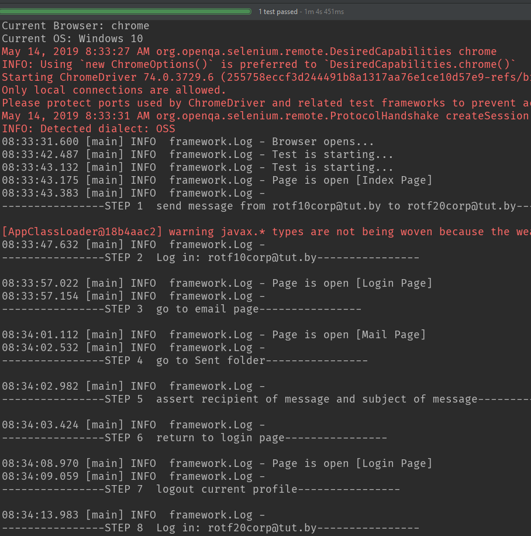

# QATests_UI_API
Status is *BACKLOG*. May be it will be rework later.

Here example of *Smoke test* by using *.NET* for Dev.by
https://github.com/MrBuslik/IDT-Test-Task

## SCENARIO

Manually create 2 e-mail boxes at tut.by

## TEST STEPS

* Send e-mail from acc1 to acc2 (use Java Mail API) with text, sent it to acc2 via to/cc/bcc (all 3 options)
* Log in to acc1 from UI. Check e-mail in Sent present
* Log in to acc2 from UI. Check e-mail in Inbox and check text has valid messag

Use TestNG, Maven, use PageObject pattern. Store Account data in xml, csv and any SQL DB (in all 3 data storages), switch between data storages, Implement data driven approach Tests should provide detailed log, make screenshots on failure and provide results in this format

## CONSOLE RESULT

## ALLURE RESULT

